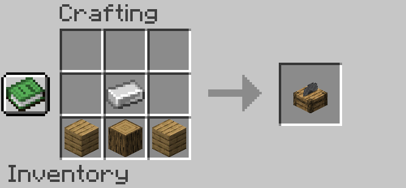

# The Woodcutter Mod for Minecraft (Fabric)

**Supported Minecraft Versions:** `26.1` | `26.1.1` | `26.1.2` | `26.2`

**Fabric version:** `0.19.3+`

A Minecraft Fabric mod that adds a **Woodcutter** block — a wooden equivalent of the Stonecutter!

## Features
- Quickly craft stairs, slabs, fences, gates, pressure plates, buttons, trapdoors, and doors from any wood type.
- Supports all 12 wood types: Oak, Spruce, Birch, Jungle, Acacia, Dark Oak, Mangrove, Cherry, Pale Oak, Crimson, Warped, and Bamboo.
- Balanced recipes with custom sound effects and 3D animated block model.
- Fully compatible with Minecraft 26.1-26.2!

## Crafting Recipe
